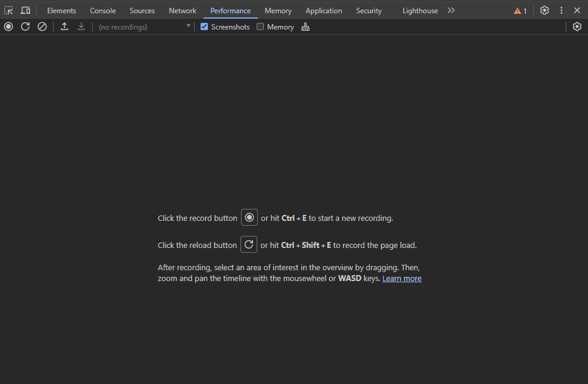

# Chrome Developer Tools for Testers

## Introduction

Chrome DevTools is a set of web developer tools built directly into the
Chrome browser. These tools allow testers and developers to debug,
profile, and audit web applications effectively. As a software tester,
Chrome DevTools can be invaluable for various testing practices, like
performance testing, accessibility testing as well as automation.

To access DevTools, press **F12** or **right click** and go to
“**Inspect**” (Image 1). To adjust the position of the panel to your
liking, go to **Customize and control DevTools** (Image 2) menu (three
vertical dots) and choose your preferred dock side or undock DevTools to
a separate window.

In this overview, we'll focus on the key features of Chrome DevTools
that are particularly useful for testers:

1.  **Elements**: Where testers can inspect and edit HTML elements and
    CSS style attributes

2.  **Device Emulation:** Used by testers to simulate responsiveness of
    the website on variously sized screens

3.  **Console**: Used primarily for inspecting logs and executing
    JavaScript code

4.  **Sources:** Used for debugging and editing JavaScript as well as
    adding breakpoints

5.  **Network:** Where the tester can view and debug all network-related
    issues

6.  **Performance:** For analyzing web page load speed and optimization

7.  **Memory:** Which assists the testers with tracking memory usage and
    locating memory-related issues

8.  **Application:** For inspecting cookies, local storage, session
    storage, IndexDB and other local databases

9.  **Security:** Used in debugging certificates and other security
    issues

10. **Lighthouse:** A tool for auditing the app/website’s SEO,
    performance, quality, and accessibility

11. **Recorder:** Used for recording user flows for performance testing

12. **Useful Extensions**

## Elements:

The elements panel serves as a tool for examining the HTML and CSS code
of a webpage directly within the browser. It enables real-time viewing
of code modifications on the webpage.

Used by testers, the elements panel facilitates experimentation with
HTML structures and webpage designs. Its functionalities include a color
picker, responsive screen sizes, CSS editor, layout analyzer, animation
builder, event listeners, and rulers.

To inspect a component, select it using the selection tool icon at the
**top left** corner of the DevTools window (image), or through the
shortcut **Ctrl + Shift + C**. This action reveals the HTML/Document
Object Model (DOM) and CSS associated with that component in the
elements panel that are currently being hovered over with the cursor.
Modifications made to the HTML or CSS are instantly reflected on the
webpage without altering the source file directly.

## Device:

The ***Dimensions*** drop-down menu lets you pick and simulate the
devices for testing. It offers presets for various popular smartphones
and tablets, although, not all devices are shown initially. You can
access more options by clicking "***Edit*...**" at the bottom of the
drop-down or by going to the DevTools Settings cog icon and selecting
the Devices tab. Here, you can enable or disable devices and even add
your own by specifying details like name, classification, browser user
agent string, device resolution, and pixel ratio. There are also useful
lists of **custom devices** you can find
[online](https://github.com/amirshnll/custom-device-emulation-chrome).

**NOTE:** It’s important to mention that emulators cannot replicate
hardware, OS variations, network complexities, or device-specific
behaviors, certain interaction methods completely. Also, emulators might
not stay updated with the latest changes in browsers and devices.

**While helpful for initial testing, using real mobile devices is
crucial for accurately assessing website or app performance across
different platforms.**

## Bandwidth Throttling:

The throttling drop-down lets you simulate slow network speeds commonly
encountered on mobile connections or unreliable Wi-Fi. This lets the
tester assess the website or application’s load speed and responsiveness
in various conditions. You can find the throttling drop-down in Chrome's
**device toolbar** and the ***Network*** tab.

You can also customize your bandwidth settings by clicking the DevTools
***Settings*** cog icon and selecting the ***Throttling*** tab.

## Console:

The console panel within the DevTools serves as the primary interface
for writing and executing JavaScript code. It also provides a platform
to observe the **log output** generated by the website.

You can access the console panel by clicking on the console panel tab
within Chrome devTools.

This functionality enables testers to dynamically inspect variable
values using the console panel. By using the **console.log()**
statements into their code, they can monitor the output in real-time as
users interact with the browser.  
  
**It’s worth reiterating, however, that this usually requires the tester
to be familiar with JavaScript.**

## Sources:

The sources panel in the Chrome developer tools provides developers and
testers with the ability to examine source code or bundled output,
primarily catering to complex JavaScript debugging tasks. It offers
features such as **viewing source files, setting breakpoints, monitoring
variables and their values, as well as conducting debugging
operations**.  
  
**Same as with the console tab, the sources tab requires to be familiar
with coding to make it effective**.

The sources panel is comprised of **three main sections**:

-   The **File Navigator** segment, located on the left, displays a file
    tree of the web application, including HTML, CSS, JavaScript, and
    other associated files like assets. It may also list files related
    to Chrome extensions.

-   The **Code Editor** segment, positioned in the center, showcases the
    source code of selected files from the File Navigator.

-   The **JavaScript Debugging** segment, situated on the right, is
    dedicated to debugging JavaScript code, offering specific tools and
    functionalities tailored for this purpose.

## Network:

The network panel within Chrome DevTools serves primarily to track
upload and download requests initiated by a webpage through the network.
It **provides comprehensive logging and analysis of all network
activities**.

Within the network panel, a waterfall graph illustrates the loading
sequence of resources within the web application. This graphical
representation aids in evaluating the **performance of each asset,
resource, and API endpoint**, facilitating optimization efforts to
enhance the web app's network performance. Additionally, the panel
offers filtering options to isolate different types of resources, such
as Fetch/XHR (for API requests), JavaScript, CSS, images, media, fonts,
documents, and others.

To assess the network performance of a web application using DevTools,
users can navigate to the network panel by selecting the ***Network***
tab. Subsequently, clearing previous logs can be achieved by clicking on
the **clear icon** or pressing **Ctrl + L**. Finally, **refreshing the
webpage** provides real-time updates on network activity, including a
dynamic waterfall graph.

The network panel provides insights into various metrics such as the
number of requests made, total data transfer, loading times, resource
downloads/uploads, caching efficiency, and other network-related
activities.  
**Network is one of the most useful DevTools panels for testers when it
comes to both manual and automated testing.**

## Performance:

The performance panel in DevTools provides testers with the means to
assess the page load performance of a web application. This involves
conducting a **performance analysis to gather metrics concerning various
aspects of the page load process, including the time taken for the
webpage to render, network resource loading times, and the page's
interactivity**.

Within the performance panel, the "**record** and **reload** page"
button enables developers and testers to initiate a performance analysis
on a webpage and access detailed metrics regarding its rendering and
loading. Triggering the reload function simulates a user visit and
interaction with the webpage, thereby giving insights into the page load
process through graphs and screenshots.

## Memory:

The memory panel within the DevTools offers in-depth analysis of a web
page's memory usage. Users can examine **memory consumption by
component, snapshot heap allocation, and record allocation timelines**.

This tool is invaluable for detecting and resolving memory-related
issues such as **leaks, bloats, and garbage collections.**

Upon opening the panel, users are presented with a summary of the web
page's memory usage, including analysis of the total JavaScript heap
size. Detailed data on memory consumption can be obtained by utilizing
the ***Take Snapshot*** button.

DevTools memory panel offers three profiling types:

-   **Heap Snapshot**: This commonly used profiling type enables users
    to capture a snapshot of the JavaScript heap at a specific moment,
    revealing the memory distribution among various JavaScript and
    related DOM elements.

-   **Allocation Instrumentation on Time**: This profiling type
    illustrates memory distribution over time as users scroll and
    interact with the web page, providing insights into JavaScript and
    DOM element memory usage.

-   **Allocation Sampling**: Mapping memory consumption for individual
    page components such as frames, documents, web workers, and graphics
    layers, this profiling type identifies sources of high memory
    consumption.

## Application:

The application panel within Chrome Developer Tools serves as a **hub
for examining and modifying various elements such as the manifest file,
service worker, cookies, local databases, and other storage
mechanisms**. Additionally, it provides **access to the website's
metadata, protocols, and icons**.

**This panel proves particularly useful for inspecting progressive web
apps that utilize local storage and APIs. It enables testers to
efficiently manage storage, caches, and databases, inspect and clear
cookies, and examine resources.**

## Security:

The security panel within DevTools is dedicated to presenting connection
security details for all network requests. Its primary function is to
assess the **security status of data transmitted through network
requests**. **Secure connections are indicated by a green lock icon**.

This panel allows testers to inspect **SSL certificates and encryption
methods associated with each network request** and the website as a
whole.

Within the security panel, users can find information regarding:

-   **Certificate verification**: This indicates whether the website has
    verified its identity using a TLS certificate.

-   **TLS connection**: This reveals whether the website employs a
    modern and secure protocol.

-   **Subresource security**: This identifies whether the website loads
    insecure HTTP subresources, indicating mixed content issues.

## Lighthouse:

Lighthouse is a tool used by testers to audit several metrics separated
into five categories. It provides a detailed report on the website’s
performance and offers recommendations for improvement. The main focus
of Lighthouse is [Core Web
Vitals](https://support.google.com/webmasters/answer/9205520?hl=en), the
metrics Google uses to measure the web/app speed and overall user
experience.

After running the audit of your webpage, Lighthouse will generate a
report on 5 different areas:

-   **Performance** includes elements that slow your page down,
    including images and resources.

-   **Accessibility** audits how accessible your content is to users,
    including the use of assistive technology.

-   **Best Practices** identifies any web development element that does
    not follow best practices.

-   **SEO** highlights the most essential SEO issues with the webpage.

-   **PWA** validates whether the web/app meets the Progressive Web App
    standards

*Lighthouse can also be integrated in testing frameworks, such as
Selenium and Cypress. It can be run using the command-line interface
(CLI) to automate testing and generate reports… (**work in progress**)*

## Recorder:

The Recorder allows testers to easily capture and replay user
interactions in web applications. Testers can record actions like
clicking buttons, filling forms, and navigating pages in real-time,
after which the tester can execute a replay of the whole recorder flow.
Additionally, the ability to export interactions as library and
framework scripts (such as Puppeteer and Playwright) enables automated
testing, reducing time and effort in future test cycles.

To run a test and create the script of it, follow these steps:

-   In DevTools, go to the "**More tools**" menu (three vertical dots)
    and select "**Recording**" from the dropdown.

-   Once you're in the "**Recording**" panel, click on the "**Start
    Recording**" button.

-   Interact with the webpage as you would during testing. Perform
    actions like clicking buttons, filling forms, navigating through
    pages, etc.

-   DevTools will capture all your interactions in real-time.

-   You can pause the recording at any time by clicking the "**Pause
    Recording**" button.

-   To resume recording, click on the "**Resume Recording**" button.

-   When you've completed your test scenario, click on the "**Stop
    Recording**" button.

Reviewing Recorded Interactions:

-   After stopping the recording, you can see and review a summary of
    the recorded interactions.

-   Identify any errors or unexpected behavior encountered during the
    test.

Replaying Interactions:

-   If needed, you can replay the recorded interactions by clicking on
    the "**Replay**" button.

-   This allows you to observe how the webpage behaves when the recorded
    actions are repeated.

You can also export the created script and replay it externally to third
party software like **Puppeteer** or **Cypress**:

-   After stopping the recording, you'll see a summary of the recorded
    interactions.

-   Review the interactions to ensure they match your testing scenario.

-   Click on the "**Export**" button to generate the Puppeteer or
    Playwright script.

-   Choose the appropriate scripting language (JavaScript or TypeScript)
    and click "**Copy**" or "**Download**" to save the script to your
    local machine.

## Useful Extensions

Lastly, here are some Chrome extensions that may help expand on the data
provided by the developer tools and help testers get more detailed
results:

-   [Web Developer
    Checklist](https://chromewebstore.google.com/detail/web-developer-checklist/iahamcpedabephpcgkeikbclmaljebjp)

-   [WAVE Evaluation
    Tool](https://chromewebstore.google.com/detail/wave-evaluation-tool/jbbplnpkjmmeebjpijfedlgcdilocofh)

-   [META SEO
    Inspector](https://chromewebstore.google.com/detail/meta-seo-inspector/ibkclpciafdglkjkcibmohobjkcfkaef)

-   [Wappalyzer](https://chromewebstore.google.com/detail/wappalyzer-technology-pro/gppongmhjkpfnbhagpmjfkannfbllamg)

-   [EditThisCookie](https://chromewebstore.google.com/detail/editthiscookie/fngmhnnpilhplaeedifhccceomclgfbg)

-   [Check My
    Links](https://chromewebstore.google.com/detail/check-my-links/kkjfobdnekhdpmgomkpeibhlnmcjgian?hl=lv)

-   [Catchpoint User
    Experience](https://chromewebstore.google.com/detail/catchpoint-user-experienc/dibilcjfahbokhiodajibcajcabfjein)

-   [Accessibility Insights for
    Web](https://chromewebstore.google.com/detail/accessibility-insights-fo/pbjjkligggfmakdaogkfomddhfmpjeni)
